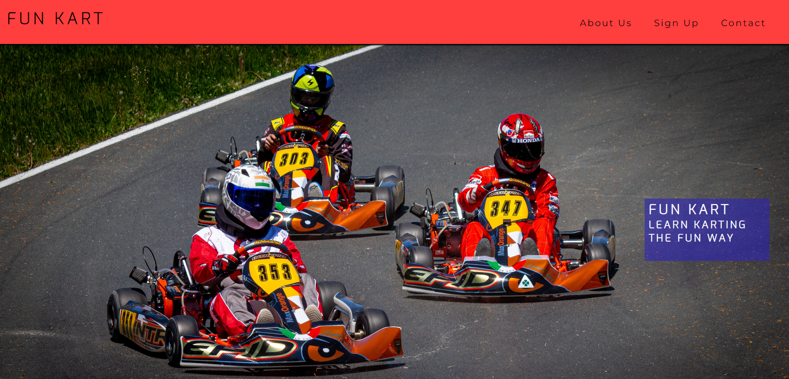
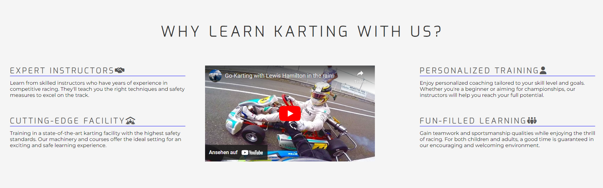
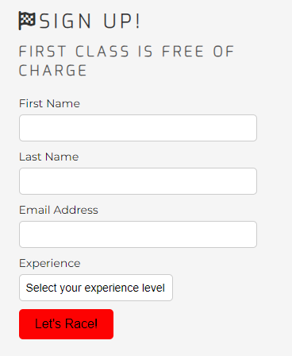
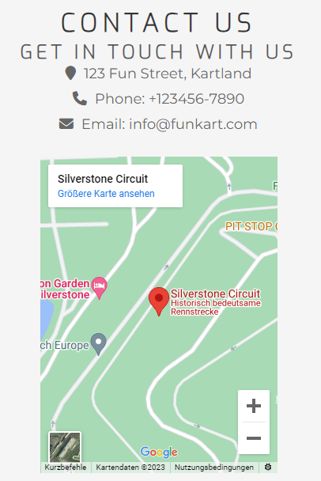
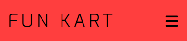
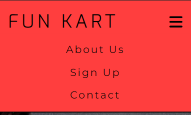
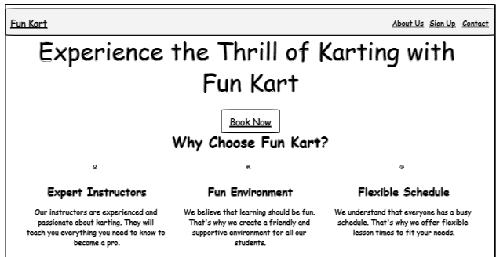
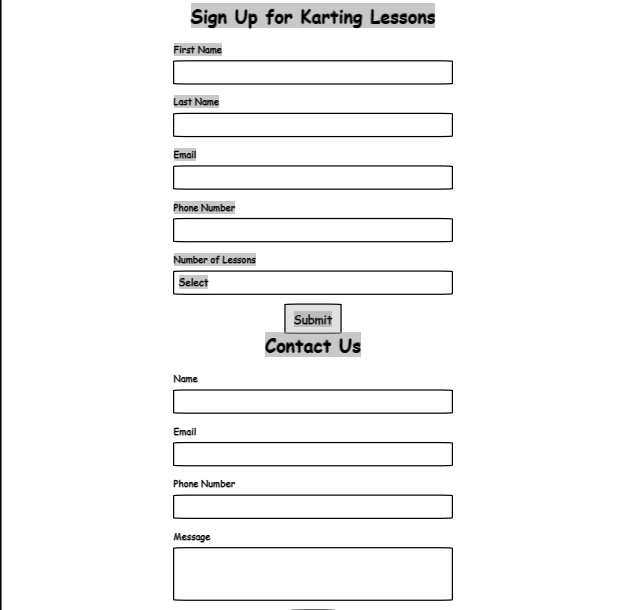
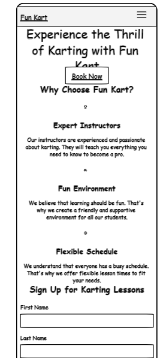

# Fun Kart - Go-Karting Lessons

As a former Go-Kart driver myself that still enjoys Go-Karting from time to time, I came up with the idea of creating a Website where people can sign up for Go-Karting lessons. Fun Kart is a contemporary platform dedicated to the exhilarating world of karting. This HTML and CSS-based website enables enthusiasts, whether novices or pros, to book karting lessons effortlessly. Dive into the world of karting with professional instructors and state-of-the-art facilities, all set to elevate your racing experience. Whether it's your first ride or your quest for championship glory, Fun Kart is your go-to digital pit stop for unforgettable karting adventures.

Link to live site: https://alex025x.github.io/fun-kart/

## Features

### General Features

**Hero Section**

The main section of the homepage embodies the spirit of Fun Kart through a striking background photo and compelling headline text. This section establishes the website's vibe and welcomes users to the thrilling realm of karting. Additionally, there's a navigation bar for quick site traversal. Each navigation link is highlighted with a hover line, guiding users to their desired sections like About Us, Sign Up, and Contact.

### 2. Why Learn Karting with Us?

In this section, we highlight the key advantages of choosing Fun Kart for karting lessons. The reasons are listed in 2 columns each with 2 rows. In the middle of them is a video showing a video of a karting lesson.

### 3. Sign Up Form

Interested users can sign up for the karting lessons using the sign-up form. The form requests basic information such as first name, last name, email address, and experience level. The first class is free of charge, calling users to take the first step in their karting journey.

### 4. Contact Us

The contact section provides essential contact information for Fun Kart. Users can reach out to us through various ways, such as phone, email, and physical address. Additionally, there is a embedded Google Maps map to help users locate the karting facility easily.

### 5. Social Links

In the footer section there are social media icons used from favicon so that users can access various social profiles of the Go-Karting school.

## Mobile-First Development Approach 

Fun Kart was developed using a mobile-first approach, ensuring that the website is fully optimized for mobile devices and smaller screens. As of course probably most users will sign up for the lessons using a mobile device, when the website is used from such device the navigation menu is opened by clicking the burger icon. As a result, the web application is responsive and user-friendly.

### Features Left to Implement

- Feedback and Reviews: A section for students to leave feedback and reviews about their lessons and instructors.
- Instructor Profiles: Detailed profiles of karting instructors with their qualifications, specializations, and student reviews.
- E-learning Resources: Videos, articles, and other resources that can help students grasp the basics before attending a physical session.
- Photo Gallery: Showcasing photos from previous lessons, events, and races.

## Testing

The project has undergone extensive testing to ensure that all features work as intended. The site has been tested on various browsers and screen sizes to ensure responsiveness and compatibility.

### Validator Testing

- **HTML:** Passed through the official W3C validator with no errors.
- **CSS:** No errors found when passing through the official (Jigsaw) validator.

### Unfixed Bugs

Currently, there are no unfixed bugs in the project, and all features work as expected.

### Wireframe

The wireframe was created using Figma, aside from a couple of small changes the structure is the same. The idea for the burger icon came from the “Love Running” Walkthrough Project that I did at Code Institute. 

## Deployment

The project has been deployed to GitHub Pages for easy access. You can access the live version of the game here: [Fun Kart](https://alex025x.github.io/fun-kart/).

## Credits

**Content:**

- Some inspiration for certain aspects from the Fun Kart project came from Code Institute’s “Love Running” Walkthrough Project.
- The following video partially helped me with creating the sign-up form: https://www.youtube.com/watch?v=lacpTQuE9u8

**Media:**

- The favicon was created using Procreate on my iPad.
-The photo from the hero section was used from a Website called “Unsplash”
-The video in the “About Us” section was used from Youtube:
https://www.youtube.com/watch?v=5moH0gXC5iQ
- Icons used in the footer were sourced from Font Awesome.
