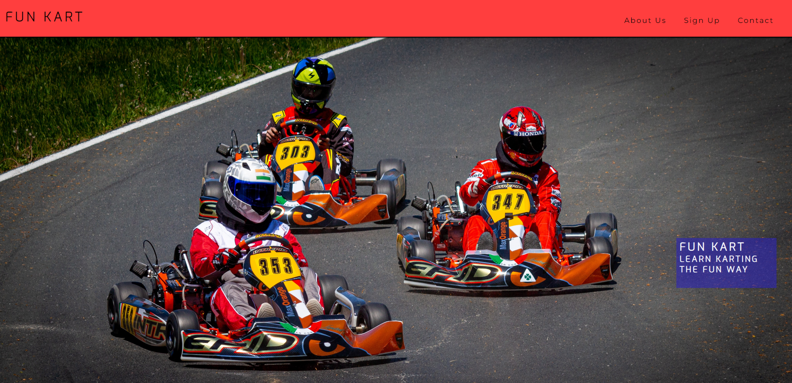
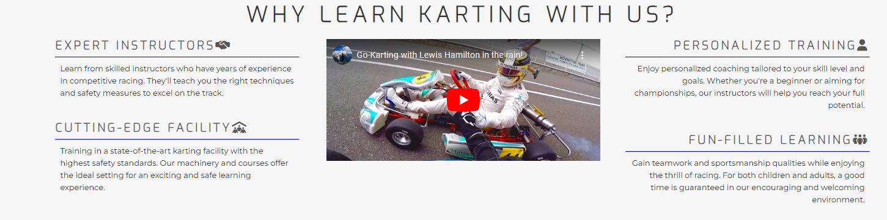
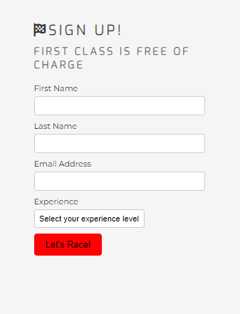
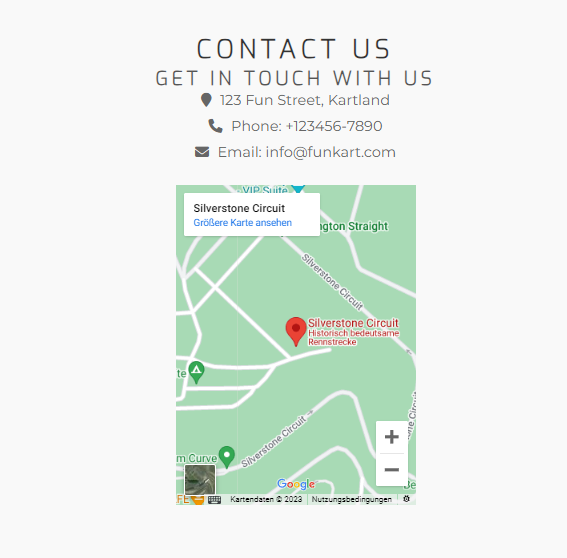

# Fun Kart - Karting Lessons for All Ages and Skill Levels

# Fun Kart

Fun Kart is a website that offers karting lessons for people of all ages and skill levels. No matter if you are a beginner looking to experience the thrill of karting or an advanced racer aiming for championships, Fun Kart has something to offer for everyone. Our expert instructors, state-of-the-art facility, personalized training, and fun-filled learning environment ensure an exciting and safe learning experience for all.

## Features

### 1. Hero Section

The hero section on the homepage showcases the essence of Fun Kart with an attractive background image and a captivating cover text. It sets the tone for the rest of the website and introduces users to the exciting world of karting.

### 2. Why Learn Karting with Us?

In this section, we highlight the key advantages of choosing Fun Kart for karting lessons. It includes four advantages:

- Expert Instructors: Learn from skilled instructors with years of competitive racing experience. They will teach you the right techniques and safety measures to excel on the track.

- Cutting-edge Facility: Train in a state-of-the-art karting facility with the highest safety standards. Our machinery and courses offer the ideal setting for an exciting and safe learning experience.

- Personalized Training: Enjoy personalized coching tailored to your skill level and goals. Our instructors will help you reach your full potential, no matter your current expertise.

- Fun-filled Learning: Gain teamwork and sportsmanship qualities while enjoying the thrill of racing. Our encouraging and welcoming environment ensures a good time for both children and adults.

### 3. Sign Up Form

Interested users can sign up for the karting lessons using the sign-up form. The form requests basic information such as first name, last name, email address, and experience level. The first class is free of charge, calling users to take the first step in their karting journey.

### 4. Contact Us

The contact section provides essential contact information for Fun Kart. Users can reach out to us through various ways, such as phone, email, and physical address. Additionally, there is a embedded Google Maps map to help users locate the karting facility easily.

## Mobile-First Development Approach (./assets/readme-images/mobileapproach.png)

Fun Kart was developed using a mobile-first approach, ensuring that the website is fully optimized for mobile devices and smaller screens. As a result, the web application is responsive and user-friendly on smartphones and tablets, providing a seamless experience for users across different devices.

---

*This project was developed with inspiration from Love Running and Coders Coffeehouse projects.*
